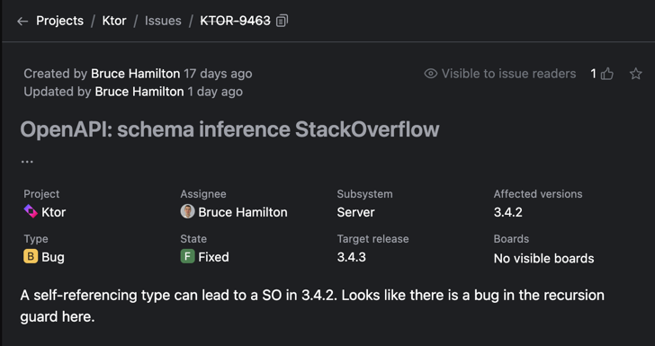
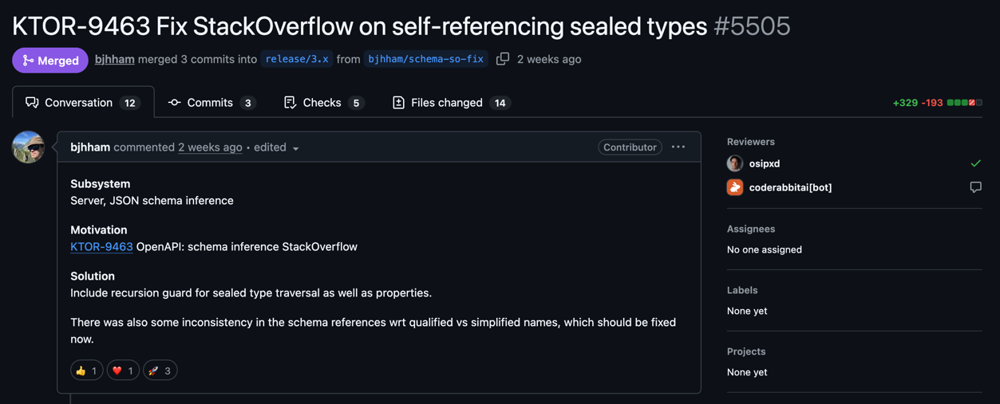
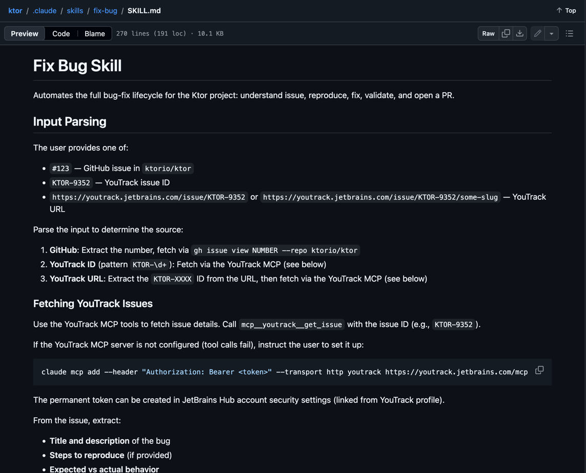

# Ktor のバグに遭遇した話

sya-ri

---


# Souya Ichikawa (sya-ri)

- フルスタックエンジニア
  - YUMEMI Part of Accenture Song
  - Kotlin, TypeScript, React, AWS, ...
- コミュニティ活動
  - Kotlin愛好会
  - try! Swift Tokyo

---


- Kotlin 製の Web フレームワーク
- Spring Boot より薄くて、小さく始めやすい
- プラグインを組み合わせて機能を拡張できる

```kotlin
fun main() {
    embeddedServer(Netty, port = 8000) {
        routing {
            get("/") {
                call.respondText("Hello, world!") 
            }
        }
    }.start(wait = true)
}
```

---

# 例えばこんなプラグインがある

<div style="display: flex; gap: 32px; align-items: flex-start;">
<div style="flex: 1 1 0; min-width: 0;">
<div style="margin-bottom: 14px;"><div style="font-weight: 700; color: #333;">Authentication</div><div style="font-size: 18px; color: #666;">認証・認可を扱う</div></div>
<div style="margin-bottom: 14px;"><div style="font-weight: 700; color: #333;">ContentNegotiation</div><div style="font-size: 18px; color: #666;">JSON などの変換を扱う</div></div>
<div style="margin-bottom: 14px;"><div style="font-weight: 700; color: #333;">Compression</div><div style="font-size: 18px; color: #666;">レスポンス圧縮を行う</div></div>
<div style="margin-bottom: 14px;"><div style="font-weight: 700; color: #333;">CORS</div><div style="font-size: 18px; color: #666;">クロスオリジン設定を行う</div></div>
<div style="margin-bottom: 14px;"><div style="font-weight: 700; color: #333;">CallLogging</div><div style="font-size: 18px; color: #666;">リクエストログを出す</div></div>
</div>
<div style="flex: 1 1 0; min-width: 0;">
<div style="margin-bottom: 14px;"><div style="font-weight: 700; color: #333;">StatusPages</div><div style="font-size: 18px; color: #666;">例外やエラー応答をまとめて扱う</div></div>
<div style="margin-bottom: 14px;"><div style="font-weight: 700; color: #333;">WebSockets</div><div style="font-size: 18px; color: #666;">WebSocket 通信を扱う</div></div>
<div style="margin-bottom: 14px;"><div style="font-weight: 700; color: #333;">Resources</div><div style="font-size: 18px; color: #666;">型安全なルーティングを書ける</div></div>
<div style="margin-bottom: 14px;"><div style="font-weight: 700; color: #333;">OpenAPI</div><div style="font-size: 18px; color: #666;">API 仕様の生成や公開に使う</div></div>
</div>
</div>

---

# 例えばこんなプラグインがある

<div style="display: flex; gap: 32px; align-items: flex-start;">
<div style="flex: 1 1 0; min-width: 0;">
<div style="margin-bottom: 14px;"><div style="font-weight: 700; color: #999;">Authentication</div><div style="font-size: 18px; color: #999;">認証・認可を扱う</div></div>
<div style="margin-bottom: 14px;"><div style="font-weight: 700; color: #999;">ContentNegotiation</div><div style="font-size: 18px; color: #999;">JSON などの変換を扱う</div></div>
<div style="margin-bottom: 14px;"><div style="font-weight: 700; color: #999;">Compression</div><div style="font-size: 18px; color: #999;">レスポンス圧縮を行う</div></div>
<div style="margin-bottom: 14px;"><div style="font-weight: 700; color: #999;">CORS</div><div style="font-size: 18px; color: #999;">クロスオリジン設定を行う</div></div>
<div style="margin-bottom: 14px;"><div style="font-weight: 700; color: #999;">CallLogging</div><div style="font-size: 18px; color: #999;">リクエストログを出す</div></div>
</div>
<div style="flex: 1 1 0; min-width: 0;">
<div style="margin-bottom: 14px;"><div style="font-weight: 700; color: #999;">StatusPages</div><div style="font-size: 18px; color: #999;">例外やエラー応答をまとめて扱う</div></div>
<div style="margin-bottom: 14px;"><div style="font-weight: 700; color: #999;">WebSockets</div><div style="font-size: 18px; color: #999;">WebSocket 通信を扱う</div></div>
<div style="margin-bottom: 14px;"><div style="font-weight: 700; color: #999;">Resources</div><div style="font-size: 18px; color: #999;">型安全なルーティングを書ける</div></div>
<div style="margin-bottom: 14px;"><div><span style="font-weight: 700; color: #dd1265;">OpenAPI</span> <span style="font-size: 18px;">👈 問題になったのはこれ</span></div><div style="font-size: 18px; color: #666;">API 仕様の生成や公開に使う</div></div>
</div>
</div>

---

# OpenAPI の生成

<div style="display: flex; gap: 20px; align-items: flex-start;">
<div style="flex: 0 0 calc(50% - 10px); min-width: 0;">
<div style="font-weight: 700; margin-bottom: 8px;">Kotlin</div>
<pre style="font-size: 12px; line-height: 1.3; margin: 0; padding: 14px; border: 1px solid #d0d7de; border-radius: 8px; background: #f6f8fa; box-sizing: border-box; width: 100%; overflow: hidden;"><code><span style="color: #ef6c00; font-weight: 700;">@Serializable
data class User(val name: String)</span>&#10;
get("/users") {
    call.respond(listOf(User("sya-ri")))
}.describe {
    <span style="color: #c62828; font-weight: 700;">summary = "Get users"</span>
    <span style="color: #1565c0; font-weight: 700;">description = "Retrieves a list of users."</span>
    responses {
        HttpStatusCode.OK {
            <span style="color: #2e7d32; font-weight: 700;">description = "A list of users"</span>
            <span style="color: #6a1b9a; font-weight: 700;">schema = jsonSchema&lt;List&lt;User&gt;&gt;()</span>
        }
    }
}</code></pre>
</div>
<div style="flex: 0 0 calc(50% - 10px); min-width: 0;">
<div style="font-weight: 700; margin-bottom: 8px;">Generated OpenAPI</div>
<pre style="font-size: 12px; line-height: 1.3; margin: 0; padding: 14px; border: 1px solid #d0d7de; border-radius: 8px; background: #f6f8fa; box-sizing: border-box; width: 100%; overflow: hidden;"><code>paths:
  /users:
    get:
      <span style="color: #c62828; font-weight: 700;">summary: Get users</span>
      <span style="color: #1565c0; font-weight: 700;">description: Retrieves a list of users.</span>
      responses:
        "200":
          <span style="color: #2e7d32; font-weight: 700;">description: A list of users</span>
          content:
            application/json:
              <span style="color: #6a1b9a; font-weight: 700;">schema:</span>
                <span style="color: #6a1b9a; font-weight: 700;">type: array</span>
                <span style="color: #6a1b9a; font-weight: 700;">items:</span>
                  <span style="color: #6a1b9a; font-weight: 700;">$ref: "#/components/schemas/User"</span>
components:
  schemas:
    <span style="color: #ef6c00; font-weight: 700;">User:</span>
      <span style="color: #ef6c00; font-weight: 700;">type: object</span>
      <span style="color: #ef6c00; font-weight: 700;">properties:</span>
        <span style="color: #ef6c00; font-weight: 700;">name:</span>
          <span style="color: #ef6c00; font-weight: 700;">type: string</span>
      <span style="color: #ef6c00; font-weight: 700;">required:</span>
        <span style="color: #ef6c00; font-weight: 700;">- name</span></code></pre>
</div>
</div>

---

# 表現したいデータ

<div style="padding: 18px; border: 1px solid #e5e7eb; border-radius: 12px; background: #fbfbfa; box-shadow: 0 1px 2px rgba(0,0,0,0.04);">
<div style="font-size: 13px; color: #9ca3af; margin-bottom: 8px;">Page</div>
<div style="font-size: 24px; font-weight: 700; margin-bottom: 12px;">チームの作業メモ</div>
<div style="padding: 10px 12px; border-radius: 8px; background: #fff; border: 1px solid #ececec; margin-bottom: 12px;">
  <div>今週のやることを整理しておく</div>
</div>
<div style="display: flex; gap: 12px; margin-bottom: 12px;">
  <div style="flex: 1; padding: 12px; border: 1px solid #ececec; border-radius: 8px; background: white;">
    <div style="padding: 28px 10px; border-radius: 6px; background: #f3f4f6; text-align: center;">画像</div>
  </div>
  <div style="flex: 1; padding: 12px; border: 1px solid #ececec; border-radius: 8px; background: white;">
    <div style="font-size: 18px; font-weight: 700; margin-bottom: 8px;">確認ポイント</div>
    <ul style="margin: 0; padding-left: 20px; line-height: 1.6;">
      <li>デザイン案を確認する</li>
      <li>レビュー観点を書き出す</li>
    </ul>
  </div>
</div>
</div>

---

# パーツとして考える

<div style="display: flex; gap: 24px; align-items: flex-start;">
<div style="flex: 0 0 calc(50% - 12px); min-width: 0;">
<div style="font-weight: 700; margin-bottom: 8px;">UI イメージ</div>
<div style="height: 100%; padding: 18px; border: 1px solid #e5e7eb; border-radius: 12px; background: #fbfbfa; box-sizing: border-box;">
  <div style="font-size: 24px; font-weight: 700; margin-bottom: 12px;">Heading (level = 1)</div>
  <div style="padding: 10px 12px; border-radius: 8px; background: #fff; border: 1px solid #ececec; margin-bottom: 12px;">Text</div>
  <div style="display: flex; gap: 12px; margin-bottom: 12px;">
    <div style="flex: 1; padding: 12px; border: 1px solid #ececec; border-radius: 8px; background: white; text-align: center;">Image</div>
    <div style="flex: 1; padding: 12px; border: 1px solid #ececec; border-radius: 8px; background: white;">
      <div style="font-size: 18px; font-weight: 700; margin-bottom: 8px;">Heading (level = 2)</div>
      <div style="padding: 8px; border-radius: 6px; background: #fff; border: 1px solid #ececec;">List</div>
    </div>
  </div>
</div>
</div>
<div style="flex: 0 0 calc(50% - 12px); min-width: 0;">
<div style="font-weight: 700; margin-bottom: 8px;">パーツ</div>
<pre style="height: 100%; font-size: 13px; line-height: 1.3; margin: 0; padding: 14px; border: 1px solid #d0d7de; border-radius: 8px; background: #f6f8fa; box-sizing: border-box; width: 100%; overflow: hidden;"><code>Heading(level = 1)
Text
TwoColumnRow(
  left  = [Image],
  right = [
    Heading(level = 2),
    List
  ]
)</code></pre>
</div>
</div>

---

<div style="display: flex; gap: 20px; align-items: flex-start;">
<div style="flex: 0 0 calc(50% - 10px); min-width: 0;">
<div style="font-weight: 700; margin-bottom: 8px;">UI イメージ</div>
<div style="padding: 18px; border: 1px solid #e5e7eb; border-radius: 12px; background: #fbfbfa; box-shadow: 0 1px 2px rgba(0,0,0,0.04);">
  <div style="font-size: 13px; color: #9ca3af; margin-bottom: 8px;">Page</div>
  <div style="font-size: 24px; font-weight: 700; margin-bottom: 12px;">チームの作業メモ</div>
  <div style="padding: 10px 12px; border-radius: 8px; background: #fff; border: 1px solid #ececec; margin-bottom: 12px;">
    <div>今週のやることを整理しておく</div>
  </div>
  <div style="display: flex; gap: 12px; margin-bottom: 12px;">
    <div style="flex: 1; padding: 12px; border: 1px solid #ececec; border-radius: 8px; background: white;">
      <div style="padding: 28px 10px; border-radius: 6px; background: #f3f4f6; text-align: center;">Image</div>
    </div>
    <div style="flex: 1; padding: 12px; border: 1px solid #ececec; border-radius: 8px; background: white;">
      <div style="font-size: 18px; font-weight: 700; margin-bottom: 8px;">確認ポイント</div>
      <ul style="margin: 0; padding-left: 20px; line-height: 1.6;">
        <li>デザイン案を確認する</li>
        <li>レビュー観点を書き出す</li>
      </ul>
    </div>
  </div>
</div>
</div>
<div style="flex: 0 0 calc(50% - 10px); min-width: 0;">
<div style="font-weight: 700; margin-bottom: 8px;">JSON</div>
<pre style="font-size: 13px; line-height: 1.1; margin: 0; padding: 12px; border: 1px solid #d0d7de; border-radius: 8px; background: #f6f8fa; box-sizing: border-box; width: 100%; overflow: hidden;"><code>{
  "blocks": [
    {
      "type": "heading",
      "text": "チームの作業メモ",
      "level": 1
    },
    {
      "type": "text",
      "text": "今週のやることを整理しておく"
    },
    {
      "type": "twoColumnRow",
      "left": [
        {
          "type": "image",
          "imageUrl": "https://example.com/mock.png"
        }
      ],
      "right": [
        { "type": "heading", "text": "確認ポイント", "level": 2 },
        {
          "type": "list",
          "items": [
            "デザイン案を確認する",
            "レビュー観点を書き出す"
          ]
        }
      ]
    }
  ]
}</code></pre>
</div>
</div>

---

<style scoped>
section {
  padding: 28px 36px;
}

pre {
  margin: 0 auto;
  width: 82%;
}

code {
  font-size: 1.32em;
  line-height: 1.1;
}

p code,
li code,
div code,
span code {
  font-size: 0.9em;
  line-height: 1;
}
</style>

<div style="display: flex; gap: 28px; align-items: flex-start;">
<div style="flex: 0 0 calc(50% - 14px); min-width: 0;">

```kotlin
@Serializable
sealed interface Block

@Serializable
data class Heading(
    val text: String,
    val level: Int,
) : Block

@Serializable
data class Text(
    val text: String,
) : Block

@Serializable
data class ListItems(
    val items: List<String>,
) : Block

@Serializable
data class Image(
    val imageUrl: String,
) : Block

@Serializable
data class TwoColumnRow(
    val left: List<Block>,
    val right: List<Block>,
) : Block
```

</div>
<div style="flex: 0 0 calc(50% - 14px); min-width: 0;">

```kotlin
val blocks = listOf(
    Heading("チームの作業メモ", 1),
    Text("今週のやることを整理しておく"),
    TwoColumnRow(
        left = listOf(
            Image("https://example.com/mock.png"),
        ),
        right = listOf(
            Heading("確認ポイント", 2),
            ListItems(
                items = listOf(
                    "デザイン案を確認する",
                    "レビュー観点を書き出す",
                ),
            ),
        ),
    ),
)
```

</div>
</div>

---

# ビルドエラー

<style scoped>
section {
  padding: 32px 36px;
}

pre {
  margin: 0;
  width: 100%;
}

code {
  font-size: 0.66em;
  line-height: 1.2;
}
</style>

```text
Exception in thread "main" java.lang.StackOverflowError
  at io.ktor.openapi.JsonSchemaInferenceKt.jsonSchemaFromAnnotations(JsonSchemaInference.kt:483)
  at io.ktor.openapi.JsonSchemaInferenceKt.jsonSchemaFromAnnotations$default(JsonSchemaInference.kt:350)
  at io.ktor.openapi.KotlinxSerializerJsonSchemaInference.buildSchemaFromDescriptor$ktor_openapi_schema(JsonSchemaInference.kt:242)
  at io.ktor.openapi.JsonSchemaInferenceKt.buildJsonSchema(JsonSchemaInference.kt:301)
  at io.ktor.openapi.JsonSchemaInferenceKt.buildJsonSchema$default(JsonSchemaInference.kt:296)
  at io.ktor.openapi.KotlinxSerializerJsonSchemaInference.buildSchemaFromDescriptor$ktor_openapi_schema(JsonSchemaInference.kt:112)
  at io.ktor.openapi.JsonSchemaInferenceKt.buildJsonSchema(JsonSchemaInference.kt:301)
  at io.ktor.openapi.JsonSchemaInferenceKt.buildJsonSchema$default(JsonSchemaInference.kt:296)
  at io.ktor.openapi.KotlinxSerializerJsonSchemaInference.buildSchemaFromDescriptor$ktor_openapi_schema(JsonSchemaInference.kt:143)
  at io.ktor.openapi.KotlinxSerializerJsonSchemaInference.buildSchemaFromDescriptor$ktor_openapi_schema$default(JsonSchemaInference.kt:94)
  at io.ktor.openapi.KotlinxSerializerJsonSchemaInference.buildSchemaFromDescriptor$ktor_openapi_schema(JsonSchemaInference.kt:172)
  at io.ktor.openapi.JsonSchemaInferenceKt.buildJsonSchema(JsonSchemaInference.kt:301)
  at io.ktor.openapi.JsonSchemaInferenceKt.buildJsonSchema$default(JsonSchemaInference.kt:296)
  at io.ktor.openapi.KotlinxSerializerJsonSchemaInference.buildSchemaFromDescriptor$ktor_openapi_schema(JsonSchemaInference.kt:143)
  at io.ktor.openapi.KotlinxSerializerJsonSchemaInference.buildSchemaFromDescriptor$ktor_openapi_schema$default(JsonSchemaInference.kt:94)
  at io.ktor.openapi.KotlinxSerializerJsonSchemaInference.buildSchemaFromDescriptor$ktor_openapi_schema(JsonSchemaInference.kt:172)
  at io.ktor.openapi.JsonSchemaInferenceKt.buildJsonSchema(JsonSchemaInference.kt:301)
  at io.ktor.openapi.JsonSchemaInferenceKt.buildJsonSchema$default(JsonSchemaInference.kt:296)
  at io.ktor.openapi.KotlinxSerializerJsonSchemaInference.buildSchemaFromDescriptor$ktor_openapi_schema(JsonSchemaInference.kt:206)
```

---

# io.ktor.plugin で問題を再現してみた

<style scoped>
section {
  padding: 28px 34px;
}

pre {
  margin: 0;
  width: 100%;
}

code {
  font-size: 0.78em;
  line-height: 1.18;
}
</style>

```kotlin
class KotlinxJsonSchemaInferenceTest : AbstractSchemaInferenceTest(
    KotlinxSerializerJsonSchemaInference.Default,
    "kotlinx"
) {
    @Test
    fun `sealed child recursion`() {
        val schema = inference.jsonSchema<TreeElement>()
        assertEquals("io.ktor.openapi.reflect.TreeElement", schema.title)
        assertEquals(2, schema.oneOf?.size)
    }
}

@Serializable
sealed interface TreeElement {
    @Serializable
    data class Leaf(val value: String) : TreeElement

    @Serializable
    data class Branch(val child: TreeElement) : TreeElement
}
```

---

# さあ、直そう

---

# 依存関係

<style scoped>
section {
  padding: 28px 32px;
}
</style>

<div style="display: grid; grid-template-columns: 1fr 52px 1fr; grid-template-rows: auto 52px auto; gap: 14px 18px; margin-top: 18px; align-items: stretch;">
  <div style="grid-column: 1; grid-row: 1; padding: 18px 18px; border-radius: 14px; background: #f8fafc; border: 2px solid #cbd5e1;">
    <div style="font-size: 15px; color: #64748b; margin-bottom: 6px;">利用側</div>
    <div style="font-size: 26px; font-weight: 700; margin-bottom: 8px;">アプリ</div>
    <div style="font-size: 17px; line-height: 1.4;"><code>build.gradle.kts</code></div>
  </div>
  <div style="grid-column: 2; grid-row: 1; display: flex; align-items: center; justify-content: center; font-size: 34px; color: #94a3b8;">→</div>
  <div style="grid-column: 3; grid-row: 1; padding: 18px 18px; border-radius: 14px; background: #eff6ff; border: 2px solid #93c5fd;">
    <div style="font-size: 15px; color: #1d4ed8; margin-bottom: 6px;">入口</div>
    <div style="font-size: 24px; font-weight: 700; margin-bottom: 8px;"><code>io.ktor.plugin</code></div>
    <div style="font-size: 17px; margin-top: 10px; color: #334155;">OpenAPI 関連の設定を有効化</div>
  </div>
  <div style="grid-column: 1; grid-row: 2; display: flex; align-items: center; justify-content: center; font-size: 34px; color: #94a3b8;">↓</div>
  <div style="grid-column: 2; grid-row: 2;"></div>
  <div style="grid-column: 3; grid-row: 2; display: flex; align-items: center; justify-content: center; font-size: 34px; color: rgba(148, 163, 184, 0.4);">↓</div>
  <div style="grid-column: 1; grid-row: 3; padding: 18px 18px; border-radius: 14px; background: #f8fafc; border: 2px solid #cbd5e1;">
    <div style="font-size: 15px; color: #64748b; margin-bottom: 6px;">Ktor 本体の API</div>
    <div style="font-size: 22px; font-weight: 700; margin-bottom: 8px;"><code>ktor-server-routing-openapi</code></div>
    <div style="font-size: 17px; margin-top: 10px; color: #334155;"><code>ktor-openapi-schema</code> に依存</div>
  </div>
  <div style="grid-column: 2; grid-row: 3; display: flex; align-items: center; justify-content: center; font-size: 34px; color: #94a3b8;">→</div>
  <div style="grid-column: 3; grid-row: 3; padding: 18px 18px; border-radius: 14px; background: #fff1f2; border: 3px solid #fb7185; box-shadow: 0 0 0 4px rgba(251,113,133,0.12);">
    <div style="font-size: 15px; color: #be123c; margin-bottom: 6px;">今回の原因</div>
    <div style="font-size: 24px; font-weight: 700; margin-bottom: 8px;"><code>ktor-openapi-schema</code></div>
    <div style="font-size: 17px; margin-top: 10px; color: #881337;">再帰データの schema 推論で StackOverflowError</div>
  </div>
</div>

---

# 調べてみたら報告されていた

https://youtrack.jetbrains.com/issue/KTOR-9463/OpenAPI-schema-inference-StackOverflow



---

# もっと調べてみたら修正されていた

https://github.com/ktorio/ktor/pull/5505



---

# 早すぎる

- 4/4 : 報告・修正済み
- 4/10 : ‼️バグに遭遇・修正を試みる
- 4/10 : マージ済み
- 4月の最終週 : 3.4.3 でリリース予定

---

# 🤔 AIの活用ってどうなんだろう

---

<style scoped>
section {
  padding: 20px;
  display: flex;
  align-items: center;
  justify-content: center;
}

img {
  max-width: 100%;
  max-height: 680px;
  width: auto;
  height: auto;
  object-fit: contain;
}
</style>



---

# おわり

Ktor 最高〜！
